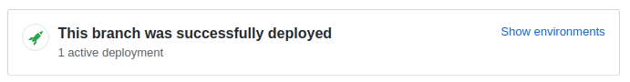
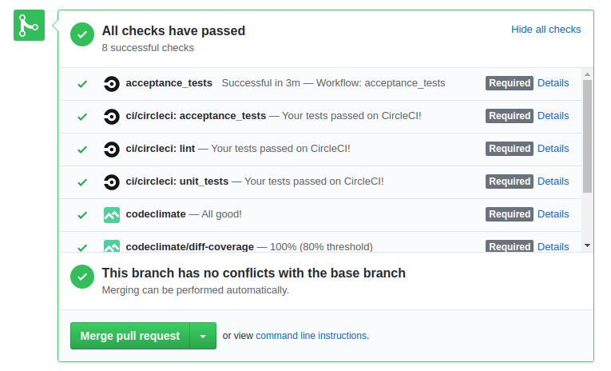

# Contribution

Freeturn uses Python3.

## Issues

The easiest way to contribute to freeturn is to tell us how to improve
it\! First, check to see if your bug or feature request has already been
submitted at
[github.com/eviltnan/freeturn/issues](https://github.com/eviltnan/freeturn/issues).

If it has, and you have some supporting information which may help us
deal with it, comment on the existing issue. If not, please [create a
new one](https://github.com/eviltnan/freeturn/issues/new), providing as
much relevant context as possible. For example, if you're experiencing
problems with installation, detail your environment and the steps you've
already taken. If something isn't displaying correctly, tell us what
browser you're using, and include a screenshot if possible.

[this text was thankfully stolen at wagtail docs]

## Pull requests

If you're a Python or Django developer, [fork
it](https://github.com/eviltnan/freeturn/) and read this contribution guide to get stuck in!
We welcome all contributions, whether
they solve problems which are specific to you or they address existing
issues. If you're stuck for ideas, pick something from the [issue
list](https://github.com/eviltnan/freeturn/issues?state=open), or [submit a question](https://portfolio.cheparev.com/freeturn/)
if you'd like us to suggest something\!

For large-scale changes, we'd generally recommend breaking them down
into smaller pull requests that achieve a single well-defined task and
can be reviewed individually.

!!! tip
    Freeturn supports [heroku review apps](https://devcenter.heroku.com/articles/github-integration-review-apps).
    For all in-repo pull requests the review apps will be created automatically and will be linked on the PR page.
    

## Checks

All the PRs will be checked using diverse tools, which include:

- circle ci main pipeline: lint + unit tests
- codeclimate issues and test coverage
- browserstack acceptance tests

all the checks must pass and the PR must be based on the current hot branch to be allowed to merge.



[this text was thankfully stolen at wagtail docs]

## Code of conducts

However you would like to contribute your idea, comment, PR or anything else, please keep in mind the following things:

- no insulting ✋
- no sexism ♂️ = ♀
- no ageism 👴 = 👨
- no homophobia 💑 = 👨‍❤️‍👨 = 👩‍❤️‍👨 = 👩‍❤️‍👩 = ❤
- no transphobia ⚧ = ♂️ = ♀
- no xenophobia 🌎
- no racism 👩🏻‍🤝‍👩🏾
- no condescending tone 🥺
- be friendly to other participants 😊
- be constructive 📊 📈📉
- be open minded ☮️
- don't be a jerk 🦄
- don't forget it is a human being at the other end 🤝

## Docs contributions

This docs is created with [mkdocs](https://www.mkdocs.org/) and hosted thankfully on readthedocs. It uses markdown language,
take a brief look at the readthedocs' [getting started with mkdocs](https://docs.readthedocs.io/en/stable/intro/getting-started-with-mkdocs.html).
Markdown is an intuitive and simple markup language, [here](https://docs.readthedocs.io/en/stable/intro/getting-started-with-mkdocs.html)
you can find more about it.

If you want to submit additional docs or spelling corrections, please submit a [pull request](#pull-requests).

## Setting up python env

* Install pyenv for managing your python versions: https://github.com/pyenv/pyenv.
* Update your pyenv versions cache: `pyenv update`
* Install python version 3.7.5 (or other you prefer or one specified in Pipfile): `pyenv install 3.7.5`
* Verify installation with `pyenv versions`. 3.7.5 must be there.
* Configure pyenv using 3.7.5 locally: `pyenv local 3.7.5`. Say `python -V`, it should reply `Python 3.7.5`
* Install pipenv: `pip install pipenv`
* Initialize pipenv environment: `pipenv install --dev`. Dev install dev deps for running tests.
* Enter virtualenv: `pipenv shell`
* Run ipython console: `ipython`. Verify you are in the right env
* Copy dotenv template to .env and fill it up: `cp .env_template .env`. See https://github.com/joke2k/django-environ for more information.
Various features can be activated over the environment, see .env_template for annotations and options
* Install pre-commit hooks with: `pre-commit install`. Read more about pre-commit: https://pre-commit.com/

```
Python 3.7.5 (default, Jan 30 2020, 12:57:36)
Type 'copyright', 'credits' or 'license' for more information
IPython 7.11.1 -- An enhanced Interactive Python. Type '?' for help.

In [1]: import wagtail
```

## Setting up binaries

Linux is a recommended platform for development, on other systems use Docker to avoid pains.

## Local development with Linux

* copy dotenv template to dotenv: `cp .env_template .env`
* Install [wkhtmltopdf](https://wkhtmltopdf.org/), version 0.12.4
* Install wagtail deps: https://docs.wagtail.io/en/v2.7.1/getting_started/index.html#dependencies-needed-for-installation
* Install [postgres database](https://www.postgresql.org/)
* Install [redis](https://redis.io/) key-value storage for caching

## Docker

Dockerfile is for running tests and demonstration purposes only, as heroku is currently considered as the main deployment platform.
Sqlite DB is used, which is not mounted to the outside of the container, so your changes will be gone after you stop the container.
Please submit an issue or a PR with your proposals for the Docker support.
Bind the port 8000 (`-p 8000:8000`)

## Updating existing installation

The default task for inv is `bootstrap`, use `invoke` to utilize local bootstrapping for development. This would recreate
all the objects created automatically as fixtures.


## CLI and invoke tasks

CLI tasks are wrapped up with [pyinvoke](https://github.com/pyinvoke/invoke). Invoke is a former fabric1 CLI part now existing as
a separate project. This is preferred over django management commands as the one subjectively requiring less boilerplate.
Please read the docs for pyinvoke for the basics. Available commands can be listed with `inv -l` (`inv` is a shortcut to `invoke`).


## Setting up s3 for uploads

Consult [the official guide by wagtial](https://wagtail.io/blog/amazon-s3-for-media-files/) and docs for [collections](https://docs.wagtail.io/en/v2.8.1/editor_manual/documents_images_snippets/collections.html).
Collections perms are not usually synced with the ACL for s3, so [wagtail-storages](https://github.com/torchbox/wagtail-storages) is keep the in sync.

## Django debug toolbar

See [configuration](configuration.md#debug-toolbar) how to easily enable the django debug toolbar for development.
